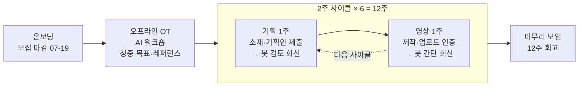
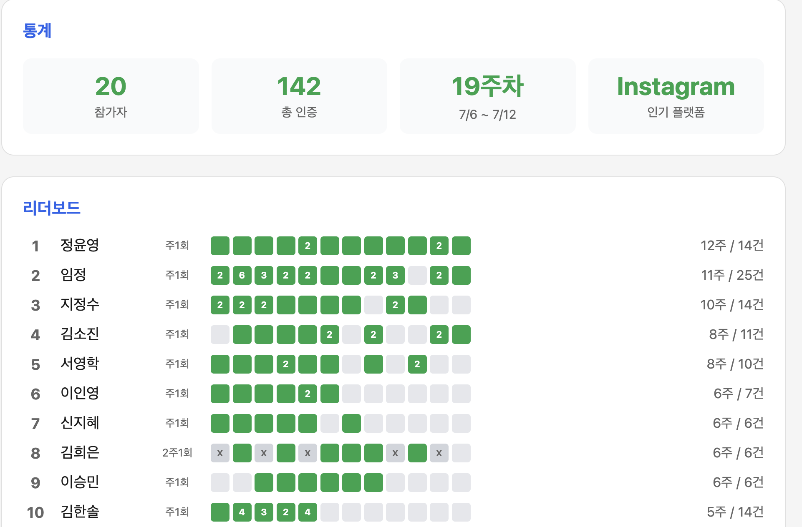
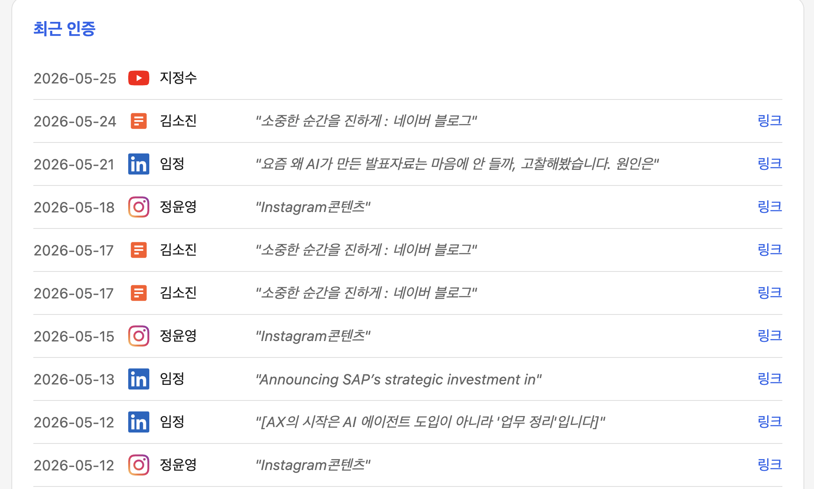

# 유튜브 챌린지: 2주에 1개, 3개월에 6개

> 기획 1주 + 제작 1주의 2주 사이클을 6번 돕니다. AI 워크숍으로 채널의 뼈대를 잡고, 매 사이클 기획안 검토와 영상 피드백을 받으며, 3개월 뒤 **검토받은 기획안 6개와 롱폼 영상 6개**를 손에 남기는 챌린지입니다.

제안: 임정 × 슬기 · 2026-07-07 · [카톡 공유용 제안서 카드](docs/kakao/)

## 01. 누구를 위한 챌린지인가

| 대상 | 이 챌린지가 해결하는 것 |
|------|------------------------|
| 🎬 콘텐츠 제작업 | 클라이언트 일에 밀려 정작 내 채널은 비어 있는 문제 |
| 🎓 강사 · 교육자 | 강의력은 있는데 그걸 증명할 공개 자산이 없는 문제 |
| ✨ 셀프브랜딩 | 글은 쌓았는데 영상이라는 다음 단계를 계속 미루는 문제 |

## 02. 왜 지금, 유튜브인가

『스토리 설계자』를 공부하며 정리한 세 가지가 이 챌린지의 출발점입니다.

- **"사람의 주의(attention)가 가장 비싼 시대"**: 지식과 콘텐츠로 일하는 사람에게 가장 희소한 자원은 고객의 주의입니다. 지금 주의가 가장 오래 머무는 곳이 영상입니다.
- **콜드 트래픽을 데우는 건 짧은 노출이 아니라 긴 신뢰**: 유튜브 롱폼은 나를 모르는 사람을 팬으로 데우는 가장 밀도 높은 매체입니다. 글 1편이 스치는 동안 영상은 몇 분의 체류를 만듭니다.
- **무료 콘텐츠가 판매의 앞단이 된다**: 잘 쌓인 무료 콘텐츠 라이브러리는 그 자체로 지식 비즈니스의 영업 자산입니다. 영상 6개는 그 라이브러리의 초석입니다.

## 03. 어떻게 진행되나: 한 장 구조

1. **기획 주**: 소재를 정하고 기획안(타깃·주제·구성)을 일요일 자정까지 Discord에 제출합니다. 봇이 AI 검토 회신을 줍니다 (후킹·타깃 적합성·구성 관점).
2. **제작 주**: 촬영·편집 후 업로드하고 일요일 자정까지 `/인증`. 봇이 간단한 피드백 회신과 함께 갤러리에 기록합니다. 롱폼만 인정하고 쇼츠는 제외합니다.
3. **미제출은 그대로 기록**: 사이클 정산 카드에 ✅/❌와 🔥연속 사이클이 자동 게시됩니다. 서로 다 보입니다.

## 04. 시작 주간의 하이라이트: AI와 함께하는 오프라인 워크숍

사이클 1이 시작되는 주(07-20 주)에 딱 한 번, 오프라인으로 모여 AI와 함께 채널의 뼈대를 만듭니다 (평일 저녁 또는 토 07-25).

| 워크숍 순서 | 내용 |
|------|------|
| ① 대상 청중 정의 | 누구의 어떤 문제를 다루는 채널인지 한 문장으로 |
| ② 채널 목표 | 12주 뒤 정량 목표: 영상 6개 + 각자 추가 지표 |
| ③ 레퍼런스 채널 3개 | AI 리서치로 벤치마크 채널을 찾고, 무엇을 배울지 분석 |

산출물은 **채널 한 장 기획서**입니다. 12주 내내 모든 기획안의 기준점이 됩니다.

> **혼자 시작하면 채널 개설에서 멈춥니다.** 워크숍에서 방향을 잡고, 사이클 1에서 채널 개설까지 함께 끝냅니다. 이후는 시스템이 2주마다 끌고 갑니다.

## 05. 일정: 7월 21일 주 시작

| 단계 | 기간 | 내용 |
|------|------|------|
| 온보딩 · 모집 | **마감 07-19(일)** | 모집 확정, Discord 서버 합류 |
| 오프라인 OT | 07-20 주 (평일 저녁 또는 토 07-25) | AI 워크숍, 사이클 1 기획 주에 함께 진행 |
| 사이클 1 | 07-20 ~ 08-02 | 기획 주에 **OT 워크숍 + 유튜브 채널 개설 포함** |
| 사이클 2 | 08-03 ~ 08-16 | |
| 사이클 3 | 08-17 ~ 08-30 | |
| 사이클 4 | 08-31 ~ 09-13 | |
| 사이클 5 | 09-14 ~ 09-27 | |
| 사이클 6 | 09-28 ~ 10-11 | |
| 마무리 모임 | 10월 중순 (오프라인) | 12주 데이터 회고 + 다음 시즌 결정 |

## 06. 이미 한 번 검증된 판입니다: 시즌1 실측

이 챌린지는 아이디어가 아니라 재가동입니다. 2026년 봄, 같은 시스템으로 12주 콘텐츠 챌린지를 운영했습니다.

**참가자 20명 · 중단 없이 12주 완주 운영 · 누적 인증 142건 · 플랫폼 7종(유튜브 포함)**

시즌1 공개 대시보드 실황입니다. 인증 자동 집계와 리더보드(위), 실시간 인증 피드(아래)가 12주 동안 사람 손 없이 돌았습니다.

| 시즌1에서 겪은 것 | 이번 시즌에 반영한 것 |
|------|------|
| "2주 1회, 플랫폼 자유" 규칙은 유연했지만 리듬이 무너지기 쉬웠음 | `구조` 기획 주·제작 주가 분리된 2주 사이클. 뭘 해야 할 주인지 항상 명확 |
| 제출만 받고 끝, 콘텐츠의 질은 각자 몫이었음 | `피드백` 기획안 AI 검토 + 영상 회신 (검증된 AI 피드백 봇 패턴 차용) |
| 7개 플랫폼 링크 수집 과정에서 일부 인증이 종종 불안정 | `안정성` 유튜브 단일화로 인증 실패 요인 제거 |
| 온라인으로만 진행되어 시작과 끝의 결속력 아쉬움 | `결속` 오프라인 OT 워크숍 + 마무리 모임 |

## 07. 12주 뒤, 각자 손에 남는 것

**개설된 유튜브 채널 1개 · 롱폼 영상 6개 · 검토받은 기획안 6개 · 🔥 사이클 스트릭 기록**

여기에 채널 한 장 기획서, 공개 아카이브 갤러리, 그리고 마무리 모임에서 12주 데이터를 놓고 하는 회고까지. 혼자서는 2~3주차에 무너지는 루틴을 시스템과 동료가 끝까지 끌고 갑니다.

## 08. 함께 정할 것: 어떻게 모을까

| A안 인맥 기반 소수 정예 | B안 스레드·링크드인 공개 모집 |
|------|------|
| 지인 추천으로 4~6인 구성 | 모집 글 자체가 콘텐츠가 되어 도달 확대 |
| 신뢰 기반이라 완주율·결속력 높음 | 다양한 직군 참가자 유입 |
| 오프라인 OT·마무리 모임 잡기 수월 | 시즌1 실측 데이터가 모집 근거 |
| △ 도달 범위가 좁고 외부 노출 효과 제한 | △ 선별·온보딩 공수 증가 |

절충안도 가능합니다. 코어 멤버는 인맥으로 확정하고, 남는 자리만 공개 모집으로 채우는 방식입니다.

## 09. 이후 액션

| 단계 | 내용 | 담당 |
|------|------|------|
| STEP 1 | 이 제안 검토 → 모집 방식(A/B/절충)과 OT 날짜 결정 | 임정 × 슬기 |
| STEP 2 | 모집: 지인 초대 또는 스레드·링크드인 모집 글, 마감 07-19(일) | 공동 |
| STEP 3 | Discord 서버 개설 + 기획 검토·인증 봇 셋업 | 임정 |
| STEP 4 | 오프라인 OT 워크숍: 채널 한 장 기획서 완성 (07-20 주) | 전원 |
| STEP 5 | 사이클 1: 채널 개설 + 첫 기획안 제출 (마감 07-26) | 전원 |

---

# 부록: 운영·시스템 구조

**상태**: 기획 단계 (2026-07-07). 운영 구조 확정, 시스템은 placeholder (`system/` 참고). 진행 확정 시 개발 착수.

## 제출과 피드백 (시스템 동작)

| 커맨드 | 언제 | 무슨 일이 일어나나 |
|--------|------|--------------------|
| `/기획` | 기획 주 일요일 자정까지 | 기획안(타깃·주제·구성) 제출 → **봇이 AI 검토 회신** (후킹·타깃 적합성·구성 관점) + 기록 |
| `/인증` | 제작 주 일요일 자정까지 | YouTube URL 제출 → 롱폼 검증(`/shorts/` 거부) → **봇이 간단 회신** + 갤러리·스트릭 기록 |
| 정산 카드 | 사이클 종료 다음 월요일 | 참가자별 ✅/❌ + 🔥연속 사이클 자동 게시 |

## 시스템 (placeholder: 확정 후 개발)

검증된 두 시스템을 차용합니다. 아키텍처와 차용 매핑은 [`system/README.md`](system/README.md) 참고.

- **인증·정산·갤러리**: [content-designer-challenge](https://github.com/ggplab/content_designer_challenge): 20명 · 12주 · 인증 142건 실운영 (Supabase Edge Functions + Discord + Sheets + GitHub Pages)
- **AI 피드백 회신**: n8n 도서 챌린지의 `/피드백` 패턴: 제출물 → AI 검토 → Discord follow-up 회신 + 로그 시트

## 문서

- [제안서 HTML](docs/proposal.html) · [전체 PNG](docs/proposal.png) · [카톡 공유용 카드 4장](docs/kakao/)
- 시즌1 운영 기록: content-designer-challenge `changelog/` · `docs/season1-pause.md`

## 운영 체크리스트 (진행 확정 시)

- [ ] 모집 방식 확정 (인맥 / 공개 / 절충) 및 모집 (마감 07-19)
- [ ] 전용 Discord 서버 개설 + 봇 초대
- [ ] OT 워크숍 일정·장소 확정
- [ ] `system/` 개발: `/기획` `/인증` 봇 + 사이클 정산 + 갤러리
- [ ] 시트·Secrets 셋업 (시즌1 인프라 재사용, 시즌2 전용 탭 분리)
- [ ] 리허설: `/기획` 1건 + `/인증` 1건 (shorts 거부 포함) + 정산 수동 트리거
