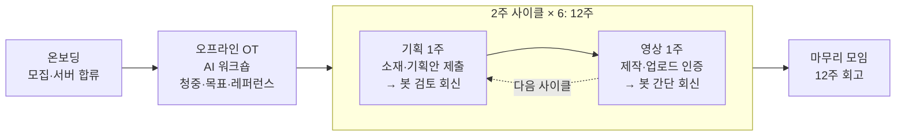

# 유튜브 챌린지: 2주에 1개, 3개월에 6개

> 콘텐츠 제작업 · 강사 · 셀프브랜딩을 하는 사람들을 위한 12주 유튜브 롱폼 챌린지.
> 기획 1주 + 제작 1주의 2주 사이클을 6번 돌려, 3개월 뒤 **검토받은 기획안 6개와 롱폼 영상 6개**를 손에 남긴다.

**상태**: 기획 단계 (2026-07-07): 운영 구조 확정, 시스템은 placeholder (`system/` 참고). 진행 확정 시 개발 착수.

## 누구를 위한 챌린지인가

| 대상 | 이 챌린지가 해결하는 것 |
|------|------------------------|
| 콘텐츠 제작업 | 클라이언트 일에 밀려 정작 내 채널은 비어 있는 문제 |
| 강사 · 교육자 | 강의력은 있는데 그걸 증명할 공개 자산이 없는 문제 |
| 셀프브랜딩 | 글은 쌓았는데 영상이라는 다음 단계를 계속 미루는 문제 |

## 전체 구조

```
온보딩 → 오프라인 OT (AI 워크숍) → [ 기획 1주 → 영상 1주 ] × 6 → 마무리 모임
          채널 방향 정의                      2주 사이클 (12주)
```



## 규칙

1. **2주 1사이클**: 홀수 주는 기획(소재 선정 + 기획안), 짝수 주는 제작(촬영·편집·업로드).
2. **마감은 매주 일요일 자정(24:00 KST)**: 기획 주는 기획안 제출, 제작 주는 업로드 + 인증.
3. **롱폼만** 인정 (`youtube.com/shorts/` URL 거부). 사이클당 인정 1개.
4. 미제출은 그대로 기록: 사이클 정산 카드에 ✅/❌와 🔥연속 사이클이 자동 게시된다.

## 일정 (2026 시즌)

| 단계 | 기간 | 내용 |
|------|------|------|
| 온보딩 · 모집 | **마감 07-19(일)** | 모집 확정, Discord 서버 합류 |
| 오프라인 OT | 07-20 주 (평일 저녁 또는 토 07-25) | AI 워크숍, 사이클 1 기획 주에 함께 진행 |
| 사이클 1 | 07-20 ~ 08-02 | 기획 주에 **OT 워크숍 + 유튜브 채널 개설 포함** |
| 사이클 2 | 08-03 ~ 08-16 | |
| 사이클 3 | 08-17 ~ 08-30 | |
| 사이클 4 | 08-31 ~ 09-13 | |
| 사이클 5 | 09-14 ~ 09-27 | |
| 사이클 6 | 09-28 ~ 10-11 | |
| 마무리 모임 | 10월 중순 (오프라인) | 12주 데이터 회고 + 다음 시즌 결정 |

## 오프라인 OT: AI와 함께하는 워크숍

사이클 1이 시작되는 주(07-20 주)에 딱 한 번, 오프라인으로 모여 AI와 함께 채널의 뼈대를 만든다 (평일 저녁 또는 토 07-25).

산출물: **채널 한 장 기획서**
1. 대상 청중 정의: 누구의 어떤 문제를 다루는 채널인가
2. 채널 목표: 12주 뒤 정량 목표 (영상 6개 + α)
3. 레퍼런스 채널 3개: AI 리서치로 벤치마크 채널 발굴·분석

## 제출과 피드백

| 커맨드 | 언제 | 무슨 일이 일어나나 |
|--------|------|--------------------|
| `/기획` | 기획 주 일요일 자정까지 | 기획안(타깃·주제·구성) 제출 → **봇이 AI 검토 회신** (후킹·타깃 적합성·구성 관점) + 기록 |
| `/인증` | 제작 주 일요일 자정까지 | YouTube URL 제출 → 롱폼 검증 → **봇이 간단 회신** + 갤러리·스트릭 기록 |
| 정산 카드 | 사이클 종료 다음 월요일 | 참가자별 ✅/❌ + 🔥연속 사이클 자동 게시 |

## 시스템 (placeholder: 확정 후 개발)

검증된 두 시스템을 차용한다. 아키텍처와 차용 매핑은 [`system/README.md`](system/README.md) 참고.

- **인증·정산·갤러리**: [content-designer-challenge](https://github.com/ggplab/content_designer_challenge): 20명 · 12주 · 인증 142건 실운영 (Supabase Edge Functions + Discord + Sheets + GitHub Pages)
- **AI 피드백 회신**: n8n 도서 챌린지의 `/피드백` 패턴: 제출물 → AI 검토 → Discord follow-up 회신 + 로그 시트

## 문서

- [제안서 (카톡 공유용)](docs/proposal.html): `docs/proposal.png`로 내보내 전달
- 시즌1 운영 기록: content-designer-challenge `changelog/` · `docs/season1-pause.md`

## 운영 체크리스트 (진행 확정 시)

- [ ] 모집 방식 확정 (인맥 / 공개 / 절충) 및 모집
- [ ] 전용 Discord 서버 개설 + 봇 초대
- [ ] OT 워크숍 일정·장소 확정
- [ ] `system/` 개발: `/기획` `/인증` 봇 + 사이클 정산 + 갤러리
- [ ] 시트·Secrets 셋업 (시즌1 인프라 재사용, 시즌2 전용 탭 분리)
- [ ] 리허설: `/기획` 1건 + `/인증` 1건 (shorts 거부 포함) + 정산 수동 트리거
